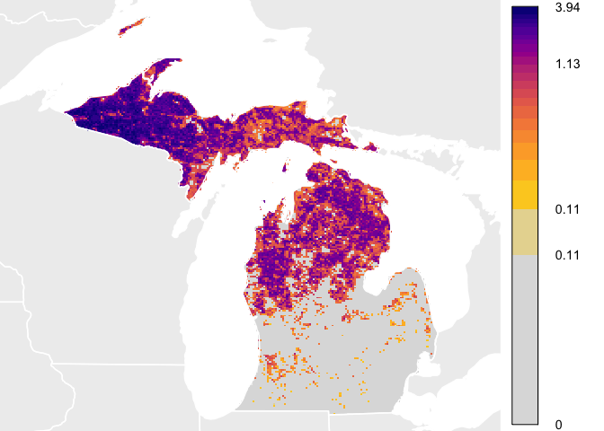

<!-- README.md is generated from README.Rmd. Please edit that file -->
    ## Loading stemhelper

stemhelper: Helper functions for STEM loading, mapping, plotting, and analysis
==============================================================================

<!-- [](http://www.gnu.org/licenses/gpl-3.0) -->
**THIS PACKAGE IS UNDER ACTIVE DEVELOPMENT. FUNCTIONALITY MAY CHANGE AT ANY TIME.**

The goal of stemhelper is to provide functionality for loading, mapping, plotting, and analyzing STEM results.

Installation
------------

You can install stemhelper from GitHub with:

``` r
# install the development version from GitHub
# install.packages("devtools")
devtools::install_github("CornellLabofOrnithology/stemhelper")
```

Vignette
--------

For a full introduction and advanced usage, please see the package [website](https://cornelllabofornithology.github.io/stemhelper). An [introductory vignette](https://cornelllabofornithology.github.io/stemhelper/articles/stem-intro-mapping.html) is available, detailing the structure of the results and how to begin loading and mapping the results. Further, an [advanced vignette](ttps://cornelllabofornithology.github.io/stemhelper/articles/stem-pipd.html) details how to access additional information from the model results about predictor importance and directionality, as well as predictive performance metrics.

Quick Start
-----------

After downloading results...

One of the first things to do is to load a RasterStack of estimated abundance predictions and plot a week of estimates.

``` r
library(viridis)

# TODO set this up to do a curl of the example results first

# SETUP PATHS
# Note, if you currently access results you can use this path construction
# by replacing the root_path with where your copy lives
root_path <- "~/Box Sync/Projects/2015_stem_hwf/documentation/data-raw/"
species <- "woothr-ERD2016-PROD-20170505-3f880822"
sp_path <- paste(root_path, species, sep = "")

# load a stack of rasters with the helper function stack_stem()
abund_stack <- stack_stem(sp_path, variable = "abundance_umean")

# calculate the full annual extent on the abundance stack (in sinusoidal projection)
sp_ext <- calc_full_extent(abund_stack)

# calculate ideal color bins for abundance values across the full year
year_bins <- calc_bins(abund_stack)

# create a thinner set of labels
bin_labels <- format(round(year_bins, 2), nsmall = 2)
bin_labels[!(bin_labels %in% c(bin_labels[1], 
                    bin_labels[round((length(bin_labels) / 4)) + 1], 
                    bin_labels[round((length(bin_labels) / 2)) + 1],
                    bin_labels[length(bin_labels) - 
                               round((length(bin_labels) / 4)) + 1],
                    bin_labels[length(bin_labels)]))] <- ""

# define mollweide projection for plotting
mollweide <- sp::CRS("+proj=moll +lon_0=-90 +x_0=0 +y_0=0 +ellps=WGS84")

# project the full annual extent to Mollweide
extent_raster <- raster::raster(ext = sp_ext, 
                                crs = sp::proj4string(template_raster))
extent_raster[is.na(extent_raster)] <- 1
sp_ext_moll <- raster::extent(raster::projectRaster(extent_raster, 
                                                    crs = mollweide))

# the helper function combine_layers() fills in with assumed and predicted zeroes
week26 <- combine_layers(abund_stack, sp_path, week = 26)
week26c <- raster::projectRaster(week26, crs = mollweide)

# to add context, pull in some reference data to add
wh <- rnaturalearth::ne_countries(continent = c("North America",
                                                "South America"))
wh_states <- rnaturalearth::ne_states(iso_a2 = unique(wh@data$iso_a2))
wh_moll <- sp::spTransform(wh, mollweide)
wh_states_moll <- sp::spTransform(wh_states, mollweide)

# plot abundance

# this is just here to properly set extent
raster::plot(week26c, 
             xaxs = 'i',
             yaxs = 'i',
             xaxt = 'n',
             yaxt = 'n',
             bty = 'n',
             ext = sp_ext_moll, 
             colNA = 'black',
             maxpixels = raster::ncell(week26c),
             legend = FALSE)

# add gray background
sp::plot(wh_moll, col = "#5a5a5a", add = TRUE)

# add the abundance layer
raster::plot(week26c, 
             xaxt = 'n', 
             yaxt = 'n',
             bty = 'n',
             ext = sp_ext_moll, 
             breaks = year_bins,
             lab.breaks = bin_labels,
             col = viridis(length(year_bins)-1),
             maxpixels = raster::ncell(week26c),
             legend = TRUE,
             add = TRUE)

# add reference layer on top
sp::plot(wh_moll, add = TRUE, border = 'black', lwd = 0.25)
sp::plot(wh_states_moll, add = TRUE, border = 'black', lwd = 0.25)
```


